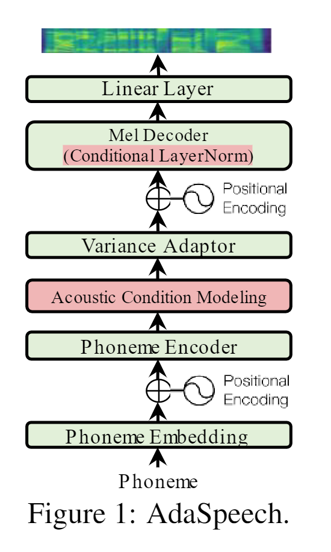
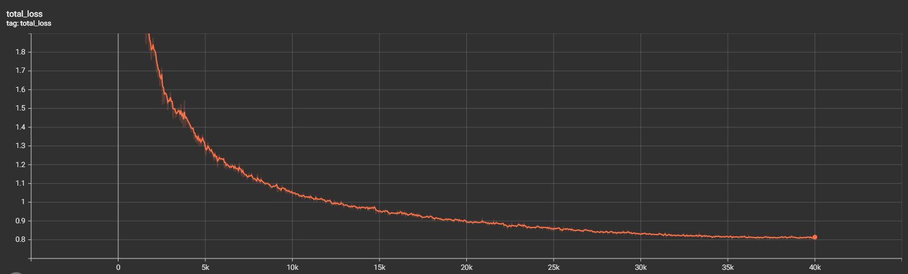
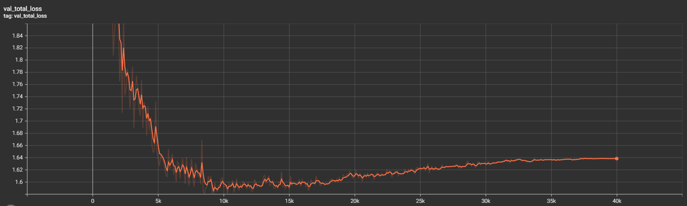
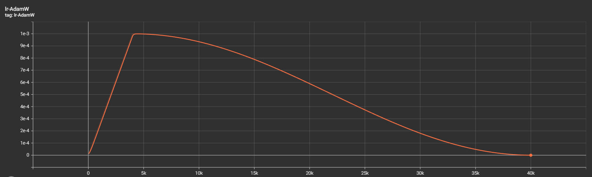
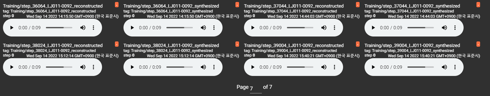
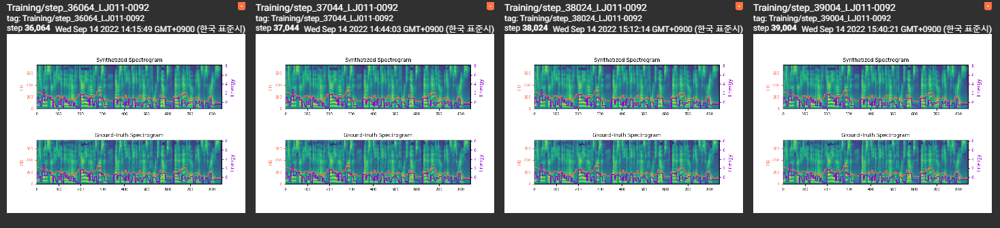

# AdaSpeech 1 - PyTorch Implementation

This is a unofficial PyTorch implementation of Microsoft's text-to-speech system [**AdaSpeech: Adaptive Text to Speech for Custom Voice**](https://arxiv.org/abs/2103.00993). 

This project is based on [ming024's implementation](https://github.com/ming024/FastSpeech2) of FastSpeech. Feel free to use/modify the code.



# Quickstart

## Dependencies

- Linux
- Python 3.7+
- PyTorch 1.10.1 or higher and CUDA

a. Create a conda virtual environment and activate it.

```shell
conda create -n adaspeech1 python=3.7
conda activate adaspeech1
```

b. Install PyTorch and torchvision following the [official instructions](https://pytorch.org/)

c. Clone this repository.

```shell
git clone https://github.com/yw0nam/Adaspeech/
cd Adaspeech
```

d. Install requirments.

```shell
pip install -r requirements.txt
```


# Training

## Datasets

The supported datasets are

- [LJSpeech](https://keithito.com/LJ-Speech-Dataset/): a single-speaker English dataset consists of 13,100 short audio clips of a female speaker reading passages from 7 non-fiction books, approximately 24 hours in total.
- [KSS](https://www.kaggle.com/datasets/bryanpark/korean-single-speaker-speech-dataset): a single-speaker korean dataset 12,853 audio clips. it consists of audio files recorded by a professional female voice actress and their aligned text extracted from b
- [Kokoro](https://github.com/kaiidams/Kokoro-Speech-Dataset): a single-speaker japanese dataset. It contains 43,253 short audio clips of a single speaker reading 14 novel books. The audio clips were split and transcripts were aligned automatically by Kokoro-Align.

You can train other datasets including multi-speaker datasets. But, you need to make textgrid yourself.

We take LJSpeech as an example hereafter.

## Preprocessing
 
First, run 
```
python3 prepare_align.py config/LJSpeech/preprocess.yaml
```
For make .lab and .wav file in raw_data folder

As described in the paper, [Montreal Forced Aligner](https://montreal-forced-aligner.readthedocs.io/en/latest/) (MFA) is used to obtain the alignments between the utterances and the phoneme sequences.
Alignments of the supported datasets are provided [here](https://drive.google.com/drive/folders/1DBRkALpPd6FL9gjHMmMEdHODmkgNIIK4?usp=sharing). (Note, this is same file of ming024)

You can find other dataset's alignments [here](https://drive.google.com/drive/folders/1xuFlztCv3YvFF7m0bzTgofIHnXpTObzb?usp=sharing)

You have to unzip the files in ``preprocessed_data/LJSpeech/TextGrid/``

After that, run the preprocessing script by
```
python3 preprocess.py config/LJSpeech/preprocess.yaml
```

Alternately, you can align the corpus by yourself. 
Download the official MFA package and run
```
./montreal-forced-aligner/bin/mfa_align raw_data/LJSpeech/ lexicon/librispeech-lexicon.txt english preprocessed_data/LJSpeech
```
or
```
./montreal-forced-aligner/bin/mfa_train_and_align raw_data/LJSpeech/ lexicon/librispeech-lexicon.txt preprocessed_data/LJSpeech
```

to align the corpus and then run the preprocessing script.
```
python3 preprocess.py config/LJSpeech/preprocess.yaml
```

## Training

Training the model using below code.

```
CUDA_VISIBLE_DEVICES=0,1 python3 train_pl.py -p config/LJSpeech/preprocess.yaml -m config/LJSpeech/model.yaml -t config/LJSpeech/train.yaml
```

# Infernce

[Here](https://drive.google.com/drive/folders/1m5bq9vkQV1VKq8QmuYoCpaf_WCk3cmWc?usp=sharing) is the pretrained model.
you can inference by

```
python3 inference.py
```

I will release inference code using the reference audio and given text soon.

# TensorBoard

Use
```
tensorboard --logdir output/log/LJSpeech/version_0/
```

to serve TensorBoard on your localhost. The loss curves, synthesized mel-spectrograms and audios are shown. 











# Note

The conditional layer normalization is implemented in this repository.
But, i haven't implemented adaptation of pre-trained models on new datasets, which is a key part of adaspeech.


# References
- [AdaSpeech: Adaptive Text to Speech for Custom Voice](https://arxiv.org/abs/2103.00993), Mingjian Chen, *et al*.
- [ming024's FastSpeech2 implementation](https://github.com/ming024/FastSpeech2)
